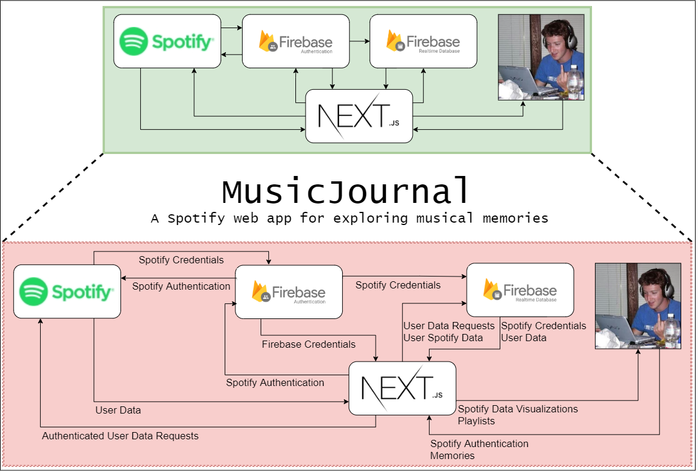
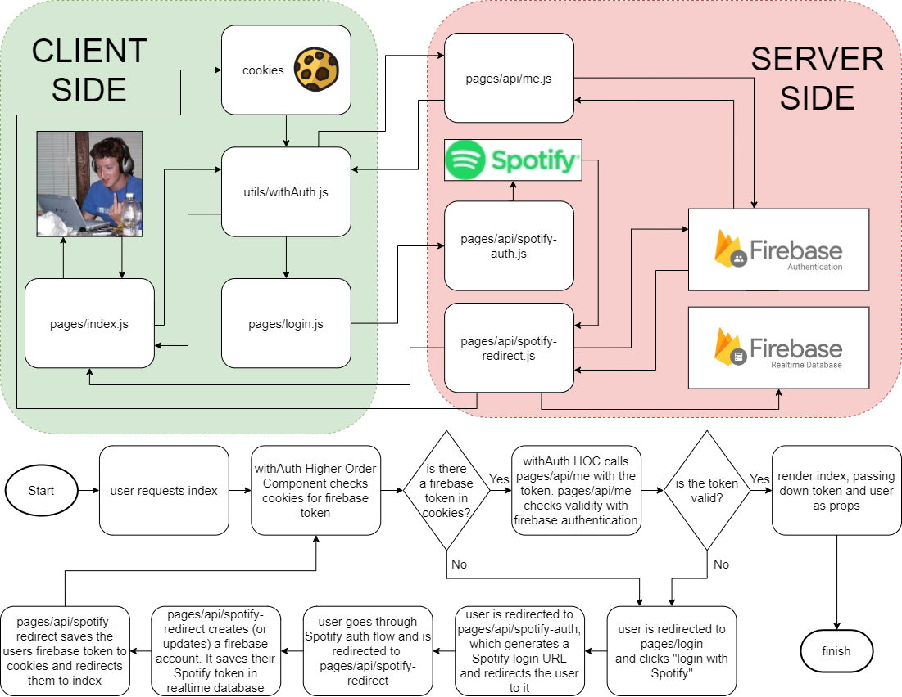

# music-journal

## Installation

* Populate .env and service-account.json

* `yarn global add firebase-tools`
* `yarn install`

## Running Locally

* `yarn deploy:local`

* Visit http://localhost:5000 in a browser

* Login with Spotify

* Navigate back to http://localhost:5000/ TODO: fix this, it shouldn't bump you back to the login screen

## Features planning

- [x] Spotify authentication with Firebase
- [x] Saving data to Firebase
- [x] Pulling data (including Spotify credentials) from Firebase
- [x] Using a users Spotify credentials to glean data from Spotify
- [x] Displaying a users recent Spotify tracks

## Settings menu

- [ ] Menu button to log out
- [ ] Display about and version number
- [ ] Display GDPR / Privacy principles
- [ ] Display link for donations
- [ ] Export, delete my data (via website?)
- [ ] Advanced: dark/light theme

## Memories

- [ ] Create, view, edit and delete simple text entries ("memories")
- [ ] Associate a memory with a song, artist or album ("Spotify DB element" or sdbe)
- [ ] Associate a memory with multiple sdbe (1 to many)
- [ ] On main page, icon to show when a song has one or memories attached, and view those memories
- [ ] Look up a song, artist or album on spotify, then create a memory

## Tags

- [ ] Create a tag with a memory
- [ ] Page for broswing tags and frequency
- [ ] Page for editing tags (e.g. like wordpress)
- [ ] Highlight tags in text of a memory with colour, click through to list of memories for that tag
- [ ] Autosuggest tags based on previously used or used by other MJ users (public!!) for that SDBE

## Sharing

- [ ] Export memories as a text item to post on social media sites/ blogs
- [ ] Friends: connect with existing spotify friends or internal system (does spotify API include friends)
- [ ] Add privacy options button for each entry on view page.
- [ ] Make memories viewable by all MJ users, all friends or specific friends
- [ ] Highlight mention of friends in memory with @ symbol and colour

## Playback

- [ ] Ability to control Spotify (next track, pause) from main window of app, and create a memory from than main window.
OR
- [ ] Ability to read "now playing" in MJ app, and any show links to any memories.
- [ ] Icon to show your memories, friends, public memories
Possibly using existing widgets

## Location

(Location is a later feature, but in many ways is a type of tag)
- [ ] Ability to select a recent track and tag a location
- [ ] Ability to see all tagged tracks on a map

## Documentation

### How authentication works

