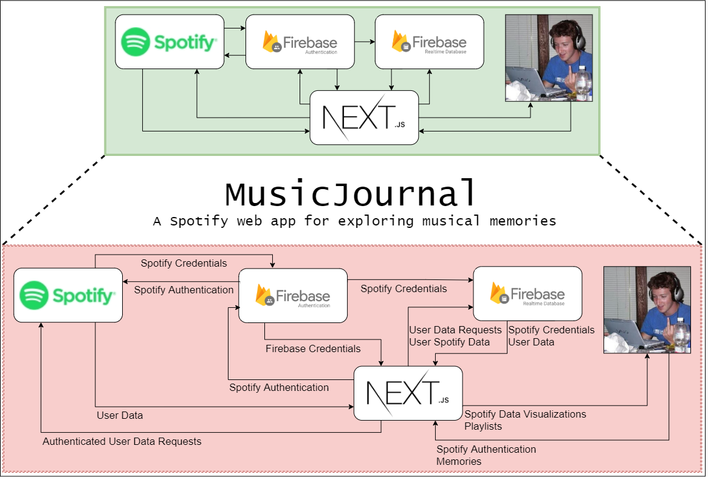

# music-journal

## Installation

* Populate .env and service-account.json

* `npm install`

## Running Locally

* `npm run dev`

* Visit http://localhost:3000 in a browser

* Login with Spotify

* Have a look at http://localhost:3000/recent-tracks

## Features

- [x] Spotify authentication with Firebase
- [x] Saving data to Firebase
- [x] Pulling data (including Spotify credentials) from Firebase
- [x] Using a users Spotify credentials to glean data from Spotify
- [x] Displaying a users recent Spotify tracks
- [ ] Ability to select a recent track and tag a location
- [ ] Ability to see all tagged tracks on a map
- [ ] Deploy to Firebase
- [ ] ???